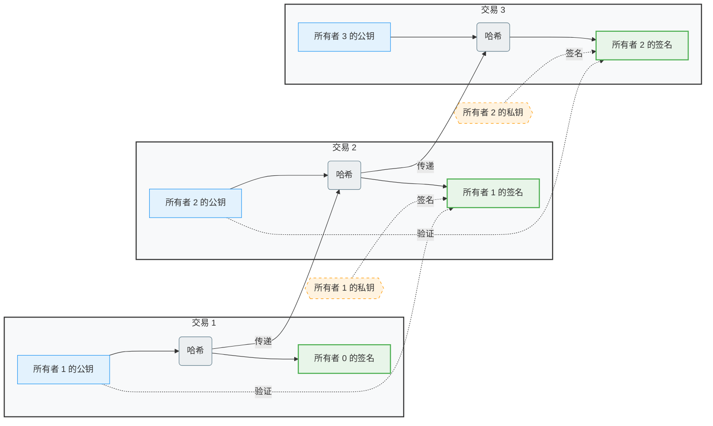

# starrujian

**GitHub ID:** starrujian

**Telegram:** 

## Self-introduction

Web3 实习计划 2025 冬季实习生

## Notes

<!-- Content_START -->
# 2026-01-23
<!-- DAILY_CHECKIN_2026-01-23_START -->


学习TypeScript基础语法。  
参加Speedrun Basic workshop、Co-Learning、第二周例会
<!-- DAILY_CHECKIN_2026-01-23_END -->

# 2026-01-22
<!-- DAILY_CHECKIN_2026-01-22_START -->


co-learning  
南塘 Dao 主题分享会  
Dapp workshop
<!-- DAILY_CHECKIN_2026-01-22_END -->

# 2026-01-21
<!-- DAILY_CHECKIN_2026-01-21_START -->


Solidity by Example | 0.8.26 Basic 部分  
残酷共学 & 休闲黑客松案例拆解分享会  
Uniswap 工作原理解析分享会
<!-- DAILY_CHECKIN_2026-01-21_END -->

# 2026-01-20
<!-- DAILY_CHECKIN_2026-01-20_START -->


参加了co-learning  
参加了Web3 公共物品资金分配第一节课分享会，Solidity Walk Through分享会  
完成了challenge1
<!-- DAILY_CHECKIN_2026-01-20_END -->

# 2026-01-19
<!-- DAILY_CHECKIN_2026-01-19_START -->


学习了Web3 实习手册智能合约开发部分，复习了solidity语法  
参加了co-learning  
参加了社区运营基础 & 活动策划与执行讲会
<!-- DAILY_CHECKIN_2026-01-19_END -->

# 2026-01-18
<!-- DAILY_CHECKIN_2026-01-18_START -->


  
整理复习了web3关键词  
回顾了之前做过的智能合约项目，为下一周的学习做准备。
<!-- DAILY_CHECKIN_2026-01-18_END -->

# 2026-01-17
<!-- DAILY_CHECKIN_2026-01-17_START -->


学习使用了notion\\notebooklm进行电子笔记制作和思维导图制作.  
对部分实习手册手写笔记进行了复习和整理  
  
**区块链基础概念**

## **一、区块链**

### **本质**

去中心化的分布式账本。

### **用途**

在网络节点之间安全、透明且不可篡改地记录事务数据。

### **区块链结构**

**区块 = 区块头 + 区块体**

-   **区块头（元数据）**
    
    -   前一区块哈希
        
    -   时间戳
        
    -   梅克尔根
        
    -   随机数
        
    -   难度目标
        
-   **区块体**
    
    -   交易数据
        

* * *

## **二、BTC**

### **意义**

BTC的诞生，是因为人类需要一个基于密码学原理而不是信任的电子支付系统。

### **原理**

将一枚电子货币定义为一条数字签名链。

### **完整系统架构**

-   **基础架构（物理基础）**
    
    -   时间戳服务器 + P2P 网络
        
-   **共识机制**
    
    -   工作量证明（PoW） + 激励机制
        
-   **数据处理与优化**
    
    -   默克尔树（Merkle Tree）+ 交易的合并和分割
        
-   **交互层**
    
    -   简化支付验证（SPV） + 隐私保护
        




* * *

## **三、区块链核心组成**

### **核心要素**

1.  **数据结构层**
    
    区块与链的物理形态。
    
2.  **共识机制**
    
    全网达成一致的规则。
    
3.  **密码学基础**
    
    系统安全的基石。
    
4.  **点对点网络**
    
    系统的承载骨架。
    
5.  **激励机制**
    
    维持系统运行的燃料。
    
6.  **智能合约**
    
    系统功能的扩展。
    

* * *

## **四、公链、联盟链、私链**

### **三种链的特点**

-   **公链**：公开
    
-   **联盟链**：重主权
    
-   **私链**：私人俱乐部
    

> ⚠️ 权衡关系：效率提高的同时，降低了去中心化程度。

* * *

## **五、Web3、Web3.0、Web2**

### **概念区分**

-   **Web2**：当前互联网。
    
-   **Web3**：去中心化互联网。
    
-   **Web3.0**：语义网驱动的数据驱动型互联网。
    

### **Web2 vs Web3 对比**

| 维度 | Web2 | Web3 |
| --- | --- | --- |
| 权力范式 | 平台中心化 | 分布式、去中心化 |
| 数据与身份 | 平台控制 | 用户自持 |
| 价值分配 | 平台主导与获取 | 参与者（用户、建设者）通过贡献获益 |
| 治理模型 | 公司垄断式集权 | 社区通过DAO共建共治 |
| 信任来源 | 中间平台 | 链上逻辑与智能合约代码 |
| 典型生态 | 社交媒体、电商平台 | DeFi、NFT、DAO、去中心化社交 |

### **Web 演进路径**

-   **Web1 → Web2**：信息革命。
    
-   **Web2 → Web3**：权力与所有权革命。
    

### **Web3 技术栈**

text

```
前端 (如 React) + 区块链交互库 (如 Ether.js) + 智能合约语言 (如 Solidity) + 去中心化存储 (如 IPFS)
```

* * *

## **六、去中心化的优势与挑战**

### **优势**

1.  **信任最小化**：无需依赖可信第三方中介。
    
2.  **韧性与可用性**：多节点分布式架构提升了系统安全性与抗故障能力。
    
3.  **用户主权**：用户可以真正自主管理自己的资产和数据。
    
4.  **开放与创新**：无需许可的协议层为全球创新者提供了平等的舞台。
    

### **挑战**

1.  **不可能三角困境**：在去中心化、安全性、可扩展性三者之间难以同时兼顾，目前普遍存在可扩展性瓶颈。
    
2.  **安全与治理平衡**：智能合约漏洞风险高，且去中心化治理效率低下，易引发分歧。
    
3.  **用户体验与成本**：交互复杂，交易速度慢且手续费（Gas费）可能高昂。
    
4.  **法律与合规风险**：匿名性与全球性给监管带来巨大挑战，存在政策不确定性。
<!-- DAILY_CHECKIN_2026-01-17_END -->

# 2026-01-16
<!-- DAILY_CHECKIN_2026-01-16_START -->


今天参加了co-learning,了解了很多关于推特运营知识。  
参加了周会，听了很多同学的分享，包括但不限于学习方法、推特运营、代码讲解。  
完成了Challenge #0 - Tokenization
<!-- DAILY_CHECKIN_2026-01-16_END -->

# 2026-01-15
<!-- DAILY_CHECKIN_2026-01-15_START -->


参加了co-learning,了解了一些参与项目时的事项和推特运营方法。  
参加了AI 及其基础概念分享会，对AI+web3有了系统性的了解。  
浏览了021ETH第二节内容
<!-- DAILY_CHECKIN_2026-01-15_END -->

# 2026-01-14
<!-- DAILY_CHECKIN_2026-01-14_START -->


今天学习了“学习手册”安全与合规章节。  
在co-learning环节了解了更多有关行业发展和职业路线的内容。  
观看了两场有关“安全、合法”的宣讲会。  
不点、不签、不装、不转、不违规、不违法
<!-- DAILY_CHECKIN_2026-01-14_END -->

# 2026-01-13
<!-- DAILY_CHECKIN_2026-01-13_START -->


今天参加了线上co-learning  
参加了“Web3 运行原理”分享会。  
学习了021ETH第一章。  
完成了几项学习任务。
<!-- DAILY_CHECKIN_2026-01-13_END -->

# 2026-01-12
<!-- DAILY_CHECKIN_2026-01-12_START -->


今天阅读了Web3 实习手册入门导读部分，并参考白皮书对区块链和ETH相关知识进行了扩展学习，以上为学习笔记。  
观看了以太坊中文周会、参加了Co-Learning、参加了Web3 行业全局介绍 & 岗位概览宣讲会。
<!-- DAILY_CHECKIN_2026-01-12_END -->
<!-- Content_END -->
