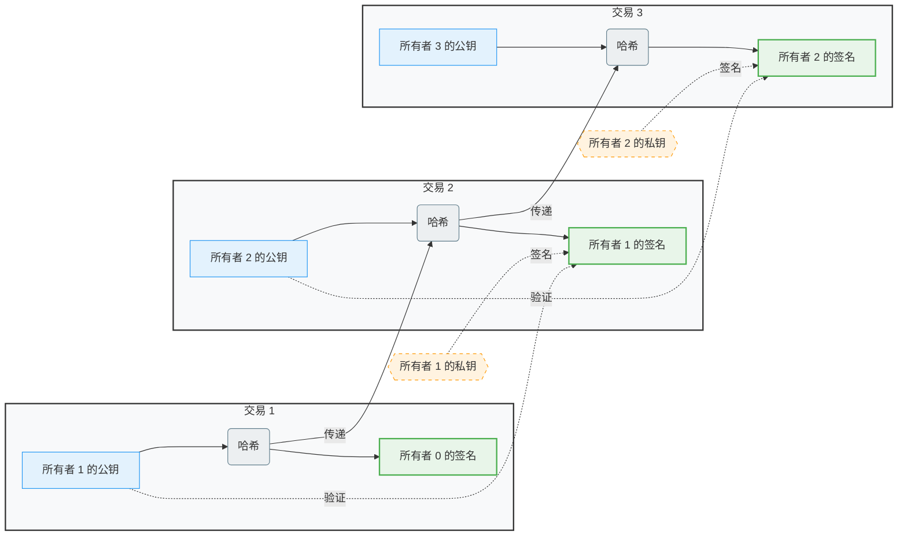

# starrujian

**GitHub ID:** starrujian

**Telegram:** 

## Self-introduction

Web3 实习计划 2025 冬季实习生

## Notes

<!-- Content_START -->
# 2026-02-06
<!-- DAILY_CHECKIN_2026-02-06_START -->
开会  
做任务，赚学分
<!-- DAILY_CHECKIN_2026-02-06_END -->

# 2026-02-05
<!-- DAILY_CHECKIN_2026-02-05_START -->

完成任务（赚学分）
<!-- DAILY_CHECKIN_2026-02-05_END -->

# 2026-02-04
<!-- DAILY_CHECKIN_2026-02-04_START -->


CO-Learning  
观看Web3 求职指南（简历优化与面试技巧）  
参加走进 Web3 DevRel 一线分享会
<!-- DAILY_CHECKIN_2026-02-04_END -->

# 2026-02-03
<!-- DAILY_CHECKIN_2026-02-03_START -->


开会  
复盘第一次黑客松
<!-- DAILY_CHECKIN_2026-02-03_END -->

# 2026-02-02
<!-- DAILY_CHECKIN_2026-02-02_START -->


开很多会
<!-- DAILY_CHECKIN_2026-02-02_END -->

# 2026-02-01
<!-- DAILY_CHECKIN_2026-02-01_START -->


黑客松
<!-- DAILY_CHECKIN_2026-02-01_END -->

# 2026-01-31
<!-- DAILY_CHECKIN_2026-01-31_START -->


很多会  
黑客松
<!-- DAILY_CHECKIN_2026-01-31_END -->

# 2026-01-30
<!-- DAILY_CHECKIN_2026-01-30_START -->


黑客松改进中  
很多会
<!-- DAILY_CHECKIN_2026-01-30_END -->

# 2026-01-29
<!-- DAILY_CHECKIN_2026-01-29_START -->


colearning  
两场会议  
黑客松项目持续ing
<!-- DAILY_CHECKIN_2026-01-29_END -->

# 2026-01-28
<!-- DAILY_CHECKIN_2026-01-28_START -->


colearning  
两场会议  
黑客松demo制作
<!-- DAILY_CHECKIN_2026-01-28_END -->

# 2026-01-27
<!-- DAILY_CHECKIN_2026-01-27_START -->


参加co-learning  
参加space和公开课  
分析黑客松选题  
下载使用claudecode  


<!-- DAILY_CHECKIN_2026-01-27_END -->

# 2026-01-26
<!-- DAILY_CHECKIN_2026-01-26_START -->


参加co-learning  
参加两场会议  
完成部分学习任务


<!-- DAILY_CHECKIN_2026-01-26_END -->

# 2026-01-25
<!-- DAILY_CHECKIN_2026-01-25_START -->


复习本周所学  
尝试在Foundry环境进行项目开发  
核心开发步骤详解

1\. 环境准备与项目初始化

-   安装Foundry：通过终端命令 `curl -L https://foundry.paradigm.xyz | bash` 安装，完成后运行 `foundryup` 并验证 `forge --version`。
    
-   创建项目：使用 `forge init your_project_name` 初始化新项目，这会生成标准的目录结构（`src/`, `test/`, `script/`, `lib/`）。
    
-   管理依赖：使用 `forge install <库名>`（例如 `forge install OpenZeppelin/openzeppelin-contracts`）来添加合约库。依赖关系会记录在 `foundry.toml` 文件中。
    

2\. 智能合约开发与测试

编写合约：在 `src/` 目录下用Solidity编写智能合约。建议采用“测试驱动开发”（TDD），即先写测试再完善逻辑。编写测试：在 `test/` 目录下用Solidity编写测试文件。Foundry支持强大的“作弊码”（cheatcodes），方便模拟各种链上条件。务必包含模糊测试（fuzz testing），用随机输入验证合约的健壮性。本地测试：运行 `anvil` 启动本地以太坊节点，然后使用 `forge test` 运行测试套件。对于复杂场景，可以使用 `anvil --fork-url <RPC_URL>` 分叉主网进行集成测试。

3\. 前端集成与本地调试

集成钱包：前端（如使用React/Vue）需要集成钱包连接库，如 Wagmi 或 Web3Modal，方便用户连接MetaMask等钱包。连接合约：使用 ethers.js、viem 或 Wagmi 库，结合已部署合约的地址和ABI，在前端调用合约的读写函数。状态与数据：用 Wagmi Hooks 或 TanStack Query 管理异步链上状态。对于复杂历史数据查询，可考虑使用 The Graph 建立索引子图。

4\. 部署、审计与发布

准备部署脚本：在 `script/` 目录下编写Solidity脚本，使用 `vm.broadcast()` 和 `vm.startBroadcast()` 管理交易广播，提高部署的自动化和可重现性。

测试网部署：务必先部署到 Sepolia 或 Amoy 等测试网进行完整流程验证。使用 `forge script` 命令并指定测试网的RPC URL和测试钱包私钥进行部署。

安全审计：在主网部署前，必须聘请如 CertiK、OpenZeppelin 等专业第三方安全公司对合约进行审计。

主网发布：使用多签钱包（如 Gnosis Safe）管理合约所有权和项目国库，以增加安全性。部署后，在Etherscan等区块链浏览器上验证并开源合约代码，以建立社区信任。
<!-- DAILY_CHECKIN_2026-01-25_END -->

# 2026-01-24
<!-- DAILY_CHECKIN_2026-01-24_START -->


学习了uniswap和aave相关知识。  
参加了LXDAO周会  
**1\. Uniswap 是什么？**

**一句话概括：** Uniswap 是世界上最大、最著名的**去中心化交易所**。

你可以把它想象成一个建立在以太坊等区块链上的、完全由代码和数学公式运行的“自动化交易市场”。它的核心目标是让任何人都能在不通过中央机构（如传统股票交易所或Coinbase、币安等中心化交易所）的情况下，安全地进行加密货币的兑换（交易）。

**它的几个核心特点和运作原理：**

1.  **去中心化：**
    
    -   **无需注册：** 你只需要一个加密货币钱包（如MetaMask）即可连接使用，无需KYC（身份认证）。
        
    -   **非托管：** 你的资产始终在你的钱包里，交易直接发生在用户之间（或用户与资金池之间），平台从不掌控你的资产。
        
    -   **抗审查：** 没有任何个人或公司能单方面阻止你进行交易。
        
2.  **自动化做市商模式：**
    
    -   这是Uniswap的革命性创新。它摒弃了传统的“订单簿”模式（买卖双方挂单等待匹配）。
        
    -   它依赖一个叫做 **“流动性池”** 的公共资金池。例如，一个ETH/USDT池，里面同时存有等值的ETH和USDT。
        
    -   价格由一个简单的常数乘积公式 `x * y = k` 自动决定（x是资产A的数量，y是资产B的数量，k是常数）。当有人用ETH购买USDT时，池子里的ETH变多，USDT变少，根据公式，USDT的价格就会自动上升。整个过程完全自动化。
        
3.  **流动性提供者：**
    
    -   任何人都可以将自己的资产存入这些资金池，成为**流动性提供者**。
        
    -   作为回报，他们可以赚取该池所有交易产生的手续费。这为普通用户提供了一种被动收益的方式。
        

**简单比喻：** 像一个无人看守的、全球性的自动售货机。任何人可以往里面放入两种饮料（提供流动性），而想兑换饮料的人只需投币（支付一种代币），机器会根据里面剩余饮料的数量自动算出该给你多少另一种饮料（交易价格），并收取一点手续费分给供货的人。  
Uniswap和AAVE是DeFi（去中心化金融）领域两个基石项目，它们的定位和核心功能完全不同。

简单来说：

-   **Uniswap** 是 **去中心化交易所（DEX）**，核心功能是让用户**交易/兑换代币**。
    
-   **AAVE** 是 **去中心化借贷协议**，核心功能是让用户**存入资产赚取利息，或抵押资产借出其他资产**。
    

为了让你更清晰地对比，我整理了它们的核心区别：

| 维度 | Uniswap (UNI) | AAVE (AAVE) |
| --- | --- | --- |
| 核心定位 | 去中心化交易所 (DEX) | 去中心化借贷协议 |
| 核心功能 | 代币兑换（交易） | 存入资产赚息 / 抵押资产借款 |
| 关键机制 | 自动化做市商：通过“流动性池”和恒定乘积公式（x*y=k） 自动定价。 | 超额抵押借贷：借款人抵押的资产价值必须高于借款价值。 |
| 用户角色 | 交易者：兑换代币。流动性提供者：向池子提供资金赚取手续费。 | 存款人：存入资产获得生息凭证（aToken）。借款人：存入抵押品借出其他资产。 |
| 原生代币主要作用 | UNI：治理代币，用于社区投票决定协议发展。 | AAVE：治理代币；质押进“安全模块”可为协议提供风险保障并获得奖励。 |
| 主要创新/特色 | 开创了AMM模式；V3版本引入“集中流动性”，大幅提升资金效率。 | 首创 “闪电贷” ，允许在同一笔交易内无抵押借款并归还，用于套利等高级操作。 |
| 主要风险 | 无常损失（提供给流动性池的资产相对价值变化可能带来的损失）。 | 清算风险：抵押品价值下跌至阈值以下，会被系统自动卖出以偿还贷款。 |

### **🔧 运作原理解析**

1.  **Uniswap：基于“流动性池”的交易**  
    Uniswap没有传统的订单簿。它依赖用户预先将成对的代币（如ETH/USDC）存入“流动性池”来提供交易资金。交易价格完全由池中两种代币数量的比例通过数学公式 **x \* y = k（恒定乘积公式）** 自动决定。提供资金的用户（流动性提供者）可以分享该池0.3%的交易手续费作为收益。
    
2.  **AAVE：基于“资金池”的借贷**  
    AAVE像一个去中心化的银行。存款人将资产（如ETH、USDC）存入共享的“资金池”以获得利息，并收到相应的**aToken**（如aETH），它会实时生息。  
    借款人则必须**超额抵押**自己的资产（例如抵押价值150美元的ETH才能借出100美元的USDC），系统通过设定的“贷款价值比”和“健康因子”来监控风险。如果抵押品价值下跌接近清算线，任何人都可以触发清算来偿还债务，确保资金池的安全。
<!-- DAILY_CHECKIN_2026-01-24_END -->

# 2026-01-23
<!-- DAILY_CHECKIN_2026-01-23_START -->


学习TypeScript基础语法。  
参加Speedrun Basic workshop、Co-Learning、第二周例会
<!-- DAILY_CHECKIN_2026-01-23_END -->

# 2026-01-22
<!-- DAILY_CHECKIN_2026-01-22_START -->


co-learning  
南塘 Dao 主题分享会  
Dapp workshop
<!-- DAILY_CHECKIN_2026-01-22_END -->

# 2026-01-21
<!-- DAILY_CHECKIN_2026-01-21_START -->


Solidity by Example | 0.8.26 Basic 部分  
残酷共学 & 休闲黑客松案例拆解分享会  
Uniswap 工作原理解析分享会
<!-- DAILY_CHECKIN_2026-01-21_END -->

# 2026-01-20
<!-- DAILY_CHECKIN_2026-01-20_START -->


参加了co-learning  
参加了Web3 公共物品资金分配第一节课分享会，Solidity Walk Through分享会  
完成了challenge1
<!-- DAILY_CHECKIN_2026-01-20_END -->

# 2026-01-19
<!-- DAILY_CHECKIN_2026-01-19_START -->


学习了Web3 实习手册智能合约开发部分，复习了solidity语法  
参加了co-learning  
参加了社区运营基础 & 活动策划与执行讲会
<!-- DAILY_CHECKIN_2026-01-19_END -->

# 2026-01-18
<!-- DAILY_CHECKIN_2026-01-18_START -->


  
整理复习了web3关键词  
回顾了之前做过的智能合约项目，为下一周的学习做准备。
<!-- DAILY_CHECKIN_2026-01-18_END -->

# 2026-01-17
<!-- DAILY_CHECKIN_2026-01-17_START -->


学习使用了notion\\notebooklm进行电子笔记制作和思维导图制作.  
对部分实习手册手写笔记进行了复习和整理  
  
**区块链基础概念**

## **一、区块链**

### **本质**

去中心化的分布式账本。

### **用途**

在网络节点之间安全、透明且不可篡改地记录事务数据。

### **区块链结构**

**区块 = 区块头 + 区块体**

-   **区块头（元数据）**
    
    -   前一区块哈希
        
    -   时间戳
        
    -   梅克尔根
        
    -   随机数
        
    -   难度目标
        
-   **区块体**
    
    -   交易数据
        

* * *

## **二、BTC**

### **意义**

BTC的诞生，是因为人类需要一个基于密码学原理而不是信任的电子支付系统。

### **原理**

将一枚电子货币定义为一条数字签名链。

### **完整系统架构**

-   **基础架构（物理基础）**
    
    -   时间戳服务器 + P2P 网络
        
-   **共识机制**
    
    -   工作量证明（PoW） + 激励机制
        
-   **数据处理与优化**
    
    -   默克尔树（Merkle Tree）+ 交易的合并和分割
        
-   **交互层**
    
    -   简化支付验证（SPV） + 隐私保护
        


```mermaid
graph LR
    %% 全局样式定义
    classDef txBox fill:#f8f9fa,stroke:#333,stroke-width:2px;
    classDef pubKey fill:#e3f2fd,stroke:#2196f3,stroke-width:1px;
    classDef privKey fill:#fff3e0,stroke:#ff9800,stroke-width:1px,stroke-dasharray: 5 5;
    classDef hashNode fill:#eceff1,stroke:#607d8b;
    classDef sigNode fill:#e8f5e9,stroke:#4caf50,stroke-width:2px;

    subgraph TX1 [交易 1]
        direction TB
        PK1[所有者 1 的公钥]:::pubKey
        H1(哈希):::hashNode
        S0[所有者 0 的签名]:::sigNode
        PK1 --> H1
        H1 --> S0
    end

    subgraph TX2 [交易 2]
        direction TB
        PK2[所有者 2 的公钥]:::pubKey
        H2(哈希):::hashNode
        S1[所有者 1 的签名]:::sigNode
        PK2 --> H2
        H2 --> S1
    end

    subgraph TX3 [交易 3]
        direction TB
        PK3[所有者 3 的公钥]:::pubKey
        H3(哈希):::hashNode
        S2[所有者 2 的签名]:::sigNode
        PK3 --> H3
        H3 --> S2
    end

    %% 外部私钥与签名逻辑
    Priv1{{所有者 1 的私钥}}:::privKey
    Priv2{{所有者 2 的私钥}}:::privKey

    %% 核心逻辑连线
    H1 -- "传递" --> H2
    H2 -- "传递" --> H3
    
    Priv1 -. "签名" .-> S1
    Priv2 -. "签名" .-> S2

    PK1 -. "验证" .-> S1
    PK2 -. "验证" .-> S2

    %% 应用样式
    class TX1,TX2,TX3 txBox;
```


* * *

## **三、区块链核心组成**

### **核心要素**

1.  **数据结构层**
    
    区块与链的物理形态。
    
2.  **共识机制**
    
    全网达成一致的规则。
    
3.  **密码学基础**
    
    系统安全的基石。
    
4.  **点对点网络**
    
    系统的承载骨架。
    
5.  **激励机制**
    
    维持系统运行的燃料。
    
6.  **智能合约**
    
    系统功能的扩展。
    

* * *

## **四、公链、联盟链、私链**

### **三种链的特点**

-   **公链**：公开
    
-   **联盟链**：重主权
    
-   **私链**：私人俱乐部
    

> ⚠️ 权衡关系：效率提高的同时，降低了去中心化程度。

* * *

## **五、Web3、Web3.0、Web2**

### **概念区分**

-   **Web2**：当前互联网。
    
-   **Web3**：去中心化互联网。
    
-   **Web3.0**：语义网驱动的数据驱动型互联网。
    

### **Web2 vs Web3 对比**

| 维度 | Web2 | Web3 |
| --- | --- | --- |
| 权力范式 | 平台中心化 | 分布式、去中心化 |
| 数据与身份 | 平台控制 | 用户自持 |
| 价值分配 | 平台主导与获取 | 参与者（用户、建设者）通过贡献获益 |
| 治理模型 | 公司垄断式集权 | 社区通过DAO共建共治 |
| 信任来源 | 中间平台 | 链上逻辑与智能合约代码 |
| 典型生态 | 社交媒体、电商平台 | DeFi、NFT、DAO、去中心化社交 |

### **Web 演进路径**

-   **Web1 → Web2**：信息革命。
    
-   **Web2 → Web3**：权力与所有权革命。
    

### **Web3 技术栈**

text

```
前端 (如 React) + 区块链交互库 (如 Ether.js) + 智能合约语言 (如 Solidity) + 去中心化存储 (如 IPFS)
```

* * *

## **六、去中心化的优势与挑战**

### **优势**

1.  **信任最小化**：无需依赖可信第三方中介。
    
2.  **韧性与可用性**：多节点分布式架构提升了系统安全性与抗故障能力。
    
3.  **用户主权**：用户可以真正自主管理自己的资产和数据。
    
4.  **开放与创新**：无需许可的协议层为全球创新者提供了平等的舞台。
    

### **挑战**

1.  **不可能三角困境**：在去中心化、安全性、可扩展性三者之间难以同时兼顾，目前普遍存在可扩展性瓶颈。
    
2.  **安全与治理平衡**：智能合约漏洞风险高，且去中心化治理效率低下，易引发分歧。
    
3.  **用户体验与成本**：交互复杂，交易速度慢且手续费（Gas费）可能高昂。
    
4.  **法律与合规风险**：匿名性与全球性给监管带来巨大挑战，存在政策不确定性。
<!-- DAILY_CHECKIN_2026-01-17_END -->

# 2026-01-16
<!-- DAILY_CHECKIN_2026-01-16_START -->


今天参加了co-learning,了解了很多关于推特运营知识。  
参加了周会，听了很多同学的分享，包括但不限于学习方法、推特运营、代码讲解。  
完成了Challenge #0 - Tokenization
<!-- DAILY_CHECKIN_2026-01-16_END -->

# 2026-01-15
<!-- DAILY_CHECKIN_2026-01-15_START -->


参加了co-learning,了解了一些参与项目时的事项和推特运营方法。  
参加了AI 及其基础概念分享会，对AI+web3有了系统性的了解。  
浏览了021ETH第二节内容
<!-- DAILY_CHECKIN_2026-01-15_END -->

# 2026-01-14
<!-- DAILY_CHECKIN_2026-01-14_START -->


今天学习了“学习手册”安全与合规章节。  
在co-learning环节了解了更多有关行业发展和职业路线的内容。  
观看了两场有关“安全、合法”的宣讲会。  
不点、不签、不装、不转、不违规、不违法
<!-- DAILY_CHECKIN_2026-01-14_END -->

# 2026-01-13
<!-- DAILY_CHECKIN_2026-01-13_START -->


今天参加了线上co-learning  
参加了“Web3 运行原理”分享会。  
学习了021ETH第一章。  
完成了几项学习任务。
<!-- DAILY_CHECKIN_2026-01-13_END -->

# 2026-01-12
<!-- DAILY_CHECKIN_2026-01-12_START -->


今天阅读了Web3 实习手册入门导读部分，并参考白皮书对区块链和ETH相关知识进行了扩展学习，以上为学习笔记。  
观看了以太坊中文周会、参加了Co-Learning、参加了Web3 行业全局介绍 & 岗位概览宣讲会。
<!-- DAILY_CHECKIN_2026-01-12_END -->
<!-- Content_END -->
